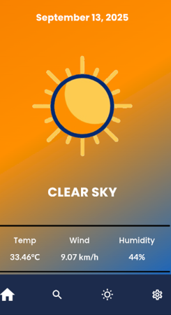
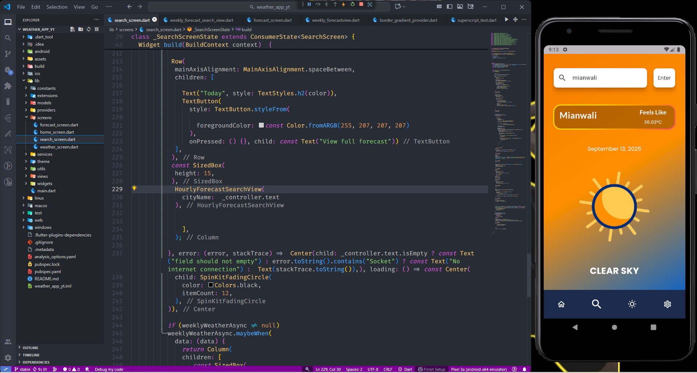
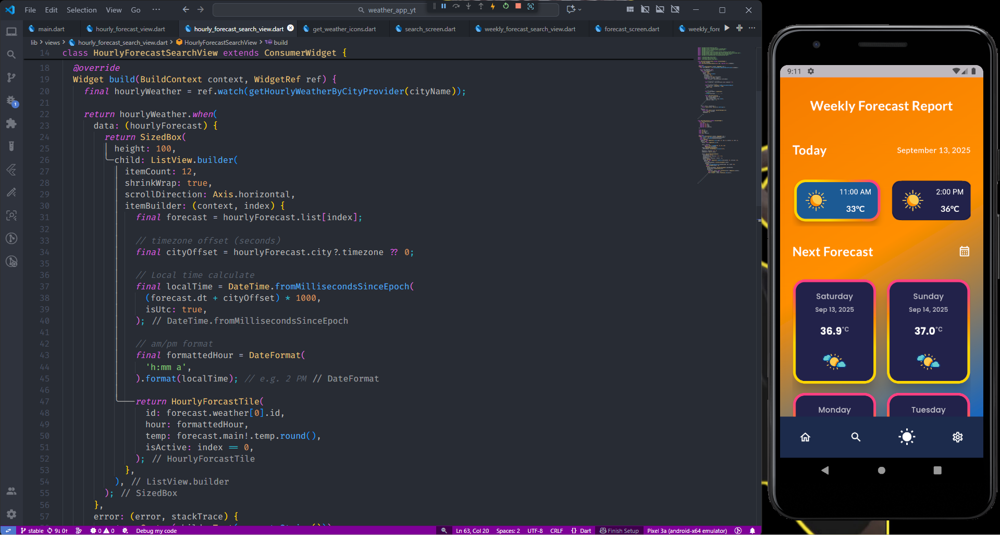

# 🌤️ Flutter Weather Forecast App

A modern and responsive Weather Forecast Application built using **Flutter** and **Riverpod** for state management.
This project focuses on clean UI design, scalable architecture, API integration, and real-time weather data handling.

The application fetches weather data from the OpenWeatherMap API and provides:

• Current weather conditions
• Next 24-hour hourly forecast
• 7-day weekly forecast
• City-based search system
• Location-based automatic weather detection

---

# 📱 Application Screens

## 🏠 Home Screen – Current Weather Overview

Displays:

• Current temperature
• Weather condition (Cloudy, Sunny, Rain, etc.)
• Humidity
• Wind speed
• Next 24-hour forecast preview
• Location-based weather detection

<p align="center">
  
</p>

---

## 🔍 Search Screen – City-Based Forecast

Features:

• Search weather by city name
• Real-time API fetching
• Clean result display
• Detailed forecast for searched city
• Temperature, condition, humidity, wind data

<p align="center">
  
</p>

---

## 📅 Weekly Forecast Screen

Displays:

• 7-day weather forecast
• Daily min & max temperature
• Weather icons
• Scrollable clean layout
• Forecast for user's current location

<p align="center">
  
</p>

---

# 🚀 Core Features

• OpenWeatherMap API Integration
• Next 24-Hour Forecast Data Parsing
• Weekly Forecast Processing
• Riverpod State Management
• Asynchronous Programming (Future & Async/Await)
• Location Services Integration
• Internet Permission Handling
• Error Handling & Loading States
• Clean Architecture Approach
• Responsive UI Design

---

# 🧠 Concepts Learned & Applied

• REST API Integration in Flutter
• JSON Parsing & Data Modeling
• Riverpod Providers & State Management
• Managing Async Data Flows
• Separation of Concerns
• Handling API Errors Gracefully
• Location-Based Services
• User Input Handling & Search Optimization
• Clean UI Structuring
• Scalable App Structure
• MVVM (Model-View-ViewModel) Architecture Implementation

---

# 🏗 Architecture – MVVM Pattern

This project follows the **MVVM (Model-View-ViewModel)** architecture using a structured and scalable folder-based approach.

## 📂 Actual Folder Structure

```
lib/
 ├── constants/     # App constants (API keys, base URLs, static values)
 ├── extensions/    # Dart extension methods
 ├── models/        # Weather data models & JSON parsing
 ├── providers/     # Riverpod providers (ViewModels / State logic)
 ├── screens/       # Main application screens
 ├── services/      # API calls & location services
 ├── theme/         # App theming & styling configuration
 ├── utils/         # Helper functions & utilities
 ├── views/         # UI sections / structured screen components
 ├── widgets/       # Reusable custom widgets
 └── main.dart      # Application entry point
```

---

## 🔎 MVVM Mapping

### 🔹 Model → `models/`

Handles JSON parsing and structured data representation for:

* Current weather
* Hourly forecast
* Weekly forecast

### 🔹 View → `screens/`, `views/`, `widgets/`

Responsible for UI rendering.
These layers:

* Display weather data
* Listen to Riverpod state changes
* Show loading & error states
* Maintain reusable UI components

### 🔹 ViewModel → `providers/`

Implements business logic using Riverpod.
Responsible for:

* Calling API services
* Managing async state
* Updating UI reactively
* Handling errors

### 🔹 Service Layer → `services/`

Handles:

* OpenWeatherMap API calls
* Location services
* Internet-based data fetching

---

This structured architecture ensures:

• Clear separation of concerns
• Scalable project growth
• Maintainable codebase
• Testable business logic
• Clean state management using Riverpod

---

---

# 🔄 Application Flow

Location Permission → Fetch Coordinates → Call OpenWeatherMap API → Parse JSON → Update Riverpod State → Display UI

OR

User Search → API Call → Parse Response → Update State → Display Forecast

---

# 🗄 Tech Stack

• Flutter
• Dart
• Riverpod
• OpenWeatherMap API
• HTTP Package
• Location Services

---

# 📦 Installation Guide

### 1️⃣ Clone Repository

```bash
git clone <repository-url>
cd weather_app
```

### 2️⃣ Install Dependencies

```bash
flutter pub get
```

### 3️⃣ Add API Key

Create a constants file and add your OpenWeatherMap API key:

```
const String apiKey = "YOUR_API_KEY";
```

### 4️⃣ Run Application

```bash
flutter run
```

---

# ⚠ Requirements

• Internet Permission Enabled
• Location Permission Enabled
• Valid OpenWeatherMap API Key

---

# 📌 Summary

This Weather App demonstrates real-world Flutter development practices including API integration, advanced state management using Riverpod, asynchronous data handling, and clean UI architecture.

The project reflects strong understanding of frontend-mobile interaction with backend services and scalable state management principles.

---

💡 Built with focus on clean design, scalable state management, and real-time data integration.
